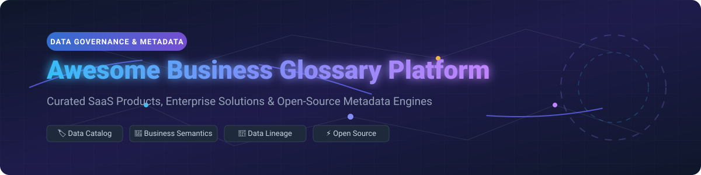
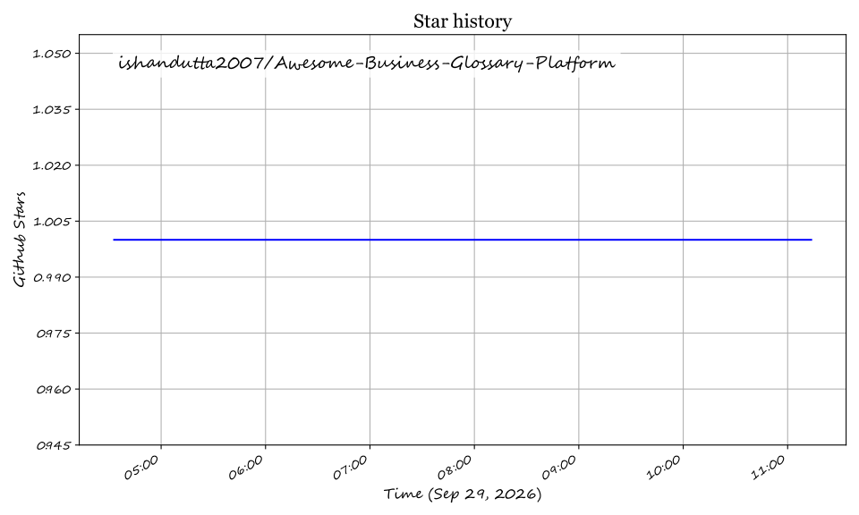

# 📚 Awesome Business Glossary Platform

  
  
  
  

---

## 💡 Overview & SEO Summary

**Business Glossary Platforms** and **Data Governance Catalogs** bridge the gap between technical data infrastructure and business terminology. A robust business glossary establishes a standardized vocabulary for business terms, KPIs, definitions, acronyms, and metrics across enterprise data assets. 

This curated repository tracks leading **SaaS/Hosted Platforms** and active **Open-Source GitHub Projects** for metadata management, automated data dictionary generation, lineage tracking, and enterprise data governance.

---

## 📊 Market Overview & Industry Insights

> 💡 **Market Size & Structure**: The global **Data Governance & Business Glossary Market** is estimated at **~$5.5 Billion USD in 2026** and is projected to reach **~$18.5 Billion by 2033** (growing at a CAGR of ~18%). The market is **moderately fragmented**, undergoing consolidation as enterprise software vendors (such as Quest Software and Informatica) acquire specialized metadata tools, while modern AI-native metadata engines (like Atlan and DataHub) capture high-growth cloud-native segments.

---

## 📋 Table of Contents
- [🏢 SaaS/Hosted Platforms](#-saashosted-platforms)
- [🔓 Open-Source GitHub Projects](#-open-source-github-projects)
- [🤝 How to Contribute](#-how-to-contribute)
- [💖 Support & Sponsorship](#-support--sponsorship)
- [⚠️ Disclaimer](#%EF%B8%8F-disclaimer)
- [📈 Star History](#-star-history)

---

## 🏢 SaaS/Hosted Platforms

The following enterprise and SaaS platforms offer hosted business glossary management, automated stewards' workflows, BI lineage, and policy enforcement.

*Sorted by Valuation / Market Size (Descending)*

| Platform 🏢 | Valuation / Company Size 💰 | Starting Price 💵 | Free Tier / Trial Limit ⏳ | Key Features & Business Glossary Focus 🔑 |
| :--- | :--- | :--- | :--- | :--- |
| **[Informatica EDC](https://www.informatica.com/)** | **~$7.64B Market Cap** *(Public: INFA)* | **~$80,000 / year** *(IPU consumption model)* | **30-day Free Trial** *(Informatica Intelligent Data Management Cloud)* | Enterprise Data Catalog with business glossary management including categories, policies, business rules, and stewardship roles. |
| **[Collibra](https://www.collibra.com/)** | **~$5.25B Valuation** *(Series G)* | **~$170,000 / year** *(Base platform license)* | **20-day Free Trial** *(Data Quality & Observability module; self-guided tours for core cloud)* | Enterprise data intelligence platform supporting configurable asset types (Business Term, Measure, KPI, Acronym), approval workflows, and semantic layer linking. |
| **[Alation](https://www.alation.com/)** | **~$1.70B Valuation** *(Series E)* | **~$60,000 / year** *(Base subscription)* | **14-day Free Trial** *(Sales-assisted guided trial / sandbox environment)* | Data catalog with Glossary Hub and Lexicon features, enabling automatic expansion of abbreviations found in data object names and suggested terms. |
| **[Atlan](https://atlan.com/)** | **~$750M Valuation** *(Series C)* | **~$100,000 / year** *(Enterprise tier)* | **14-day Free Trial** *(Custom sandbox environment provided upon request)* | Modern data catalog with programmatic glossary management via Python SDK, supporting glossaries, categories, and terms with relationships. |
| **[Microsoft Purview](https://purview.microsoft.com/)** | **Enterprise Division** *(Microsoft M365 Ecosystem)* | **$12 / user / month** *(Standalone suite add-on; M365 E5 at $60/mo)* | **30-day Free Trial** *(Microsoft 365 Enterprise E5 / Purview Trial)* | Data governance platform with Business Glossary supporting rich-text definitions, CSV import/export, approval workflows, and term hierarchy. |
| **[erwin Data Intelligence](https://erwin.com/)** | **Acquired by Quest Software** *(Subsidiary)* | **~$20,000 / year** *(Enterprise quote)* | **14-day Free Trial** *(Guided trial request via Quest Software portal)* | Data governance suite with Business Glossary Manager supporting catalogs, sub-catalogs, business terms, policies, rules, and stewardship assignments. |
| **[OvalEdge](https://www.ovaledge.com/)** | **Acquired by FutureTech Holding** | **$100 / user / month** *(+ $100/connector/mo)* | **14-day Free Trial** *(Full product demo & sandbox trial)* | Data catalog with Business Glossary domains, categories, subcategories, governance role inheritance, and domain relationship dashboards. |
| **[DataGalaxy](https://www.datagalaxy.com/)** | **~$10M Funding** *(Series Seed/A)* | **~$15,000 / year** *(Starter tier editor licenses)* | **14-day Free Trial** *(Custom trial environment post-demo)* | Data knowledge platform with Business Glossary featuring AI-assisted term discovery, automated relationship detection, and certification campaigns. |
| **[Alex Solutions](https://alexsolutions.com/)** | **Independent / Bootstrapped** | **~$30,000 / year** *(Enterprise deployment)* | **14-day Free Trial** *(Sales-hosted proof of concept)* | Data intelligence platform emphasizing bidirectional lineage between glossary terms and technical assets, ownership accountability, and tool integration. |

---

## 🔓 Open-Source GitHub Projects

These open-source platforms provide transparent, self-hosted, and customizable foundations for building business glossaries, semantic models, and metadata graphs.

*Sorted by GitHub Stars_Count (Descending)*

| Project 📦 | Stars_Count 🌟 | Description & Glossary Capabilities 📖 |
| :--- | :--- | :--- |
| **[OpenMetadata](https://github.com/open-metadata/OpenMetadata)** |  | Open-source platform for data discovery, observability, and governance built around a central metadata repository. Covers stewardship workflows, search, column-level lineage, automated quality checks, and business glossaries. |
| **[DataHub](https://github.com/datahub-project/datahub)** |  | Extensible metadata platform originally built at LinkedIn. Business Glossary capabilities include creating hierarchical terms, organizing definitions, linking terms to datasets, and exposing APIs/SDKs for AI agent integration. |
| **[Unity Catalog](https://github.com/unitycatalog/unitycatalog)** |  | Open-source catalog for data and AI assets hosted by LF AI & Data Foundation. Provides a unified three-level namespace, permission enforcement, and semantic metadata tagging across delta tables and AI models. |
| **[Apache Atlas](https://github.com/apache/atlas)** |  | Scalable and extensible set of core governance services for Hadoop and enterprise data ecosystems. Includes business term taxonomies, classification, and lineage mapping. |
| **[Amundsen](https://github.com/amundsen-io/amundsen)** |  | Data discovery and metadata engine originally developed by Lyft. Provides search, column descriptions, and glossary features to improve data analyst productivity. |
| **[Apache Gravitino](https://github.com/apache/gravitino)** |  | High-performance, geo-distributed metadata lake that federates metadata across data warehouses, lakehouses, streaming platforms, and AI systems under a single unified REST API. |
| **[Marquez](https://github.com/MarquezProject/marquez)** |  | Open-source metadata service for data ecosystems. Collects, aggregates, and visualizes dataset metadata, job executions, column lineage, and contextual business descriptions. |
| **[Intugle Data Tools](https://github.com/intugle/data-tools)** |  | Open-source Python library of AI tools that helps build a semantic layer over fragmented datasets, automatically generating business glossaries directly from raw database tables. |
| **[NADA Catalog](https://github.com/ihsn/nada)** |  | Open-source micro-data catalog engine for managing and disseminating research data compliant with DDI and Dublin Core metadata standards. |

---

## 🤝 How to Contribute

1. 🍴 Fork the repository.
2. 📝 Add/edit entries in `README.md` (follow existing tabular and markdown formatting).
3. ℹ️ Include: platform name, official website/repo link, key pricing/star metrics, and a concise 1–2 sentence description.
4. 🚀 Submit a Pull Request with a clear explanation of your additions.

---

## 💖 Support & Sponsorship

Thank you for visiting and using this curated resource! If you find this list helpful for your data governance strategy, project architecture, or research, please consider supporting the project:

- ⭐ **Star** this repository on GitHub to show your appreciation and boost visibility.
- 🍴 **Fork** and share it with fellow data stewards, architects, and engineers.
- ☕ **Buy me a coffee / Sponsor**: If you'd like to support ongoing updates, maintenance, and new open-source resource lists, consider sponsoring via the [GitHub Sponsor Dashboard](https://github.com/sponsors/ishandutta2007).

Your support is greatly appreciated and helps keep this list active and up-to-date!

---

## ⚠️ Disclaimer

- This list is **community-curated** for educational and research purposes.
- Enterprise pricing and trial policies are subject to vendor modifications; consult official vendor representatives for official quotes.
- Business glossary and metadata governance deployments must comply with relevant privacy regulations (GDPR, CCPA, HIPAA) and corporate compliance policies.

---

## 📈 Star History

## Star History

<a href="https://star-history.com/#ishandutta2007/Awesome-Business-Glossary-Platform&Timeline" align="center">
  <picture>
    <source media="(prefers-color-scheme: dark)" srcset="assets/ishandutta2007_Awesome-Business-Glossary-Platform_growth.svg">
    
  </picture>
</a>
